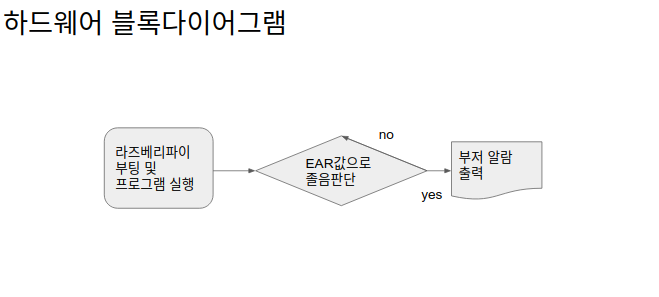
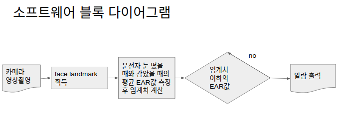
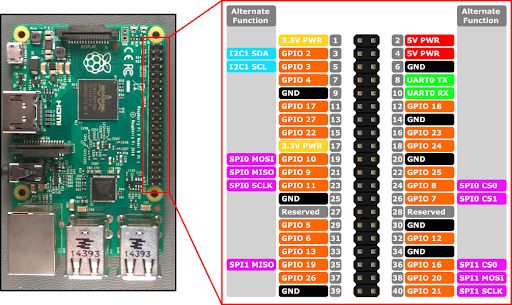
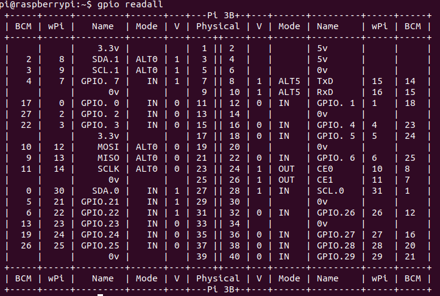

# Team Logo


## 팀소개 및 프로잭트 설명 동영상

졸음운전 여부를 판단하여 알림을 통해 사고를 예방하는 기기를 제작하는 팀입니다.

졸음운전의 단계를 drowsing, sleeping 두 단계로 나누어 각각의 상황에 조치를 해주는 시스템입니다.

온라인해커톤으로의 전환에 따라 부대에서 잘못된 부품,전선 및 센서들을 구매하고 확인하지 못하여 라즈베리 파이 프로토타입 제작 과정 중 하드웨어 구성을 완전하게 하지 못했습니다. 아래 영상은 라즈베리가 아닌 우분투 os 노트북 환경에서 실행한 프로젝트입니다.  
* 라즈베리 파이 부저알림 --> 얼굴을 감싸는 앵커 우측 하단에 "drowsing" 또는 "SLEEPING"으로 표시 및 터미널 출력
* 그 외 기능 동일

[](https://youtu.be/s2uMnYTOk5w)

## 기능 설계




## 컴퓨터 구성 / 필수 조건 안내 (Prerequisites)
* Debian 계열 os
* openCV 4.X 버전
* (권장)라즈베리파이 3B+
* 피에조 부저 필요(GPIO 16번 연결)

## 기술 스택 (Technique Used)

### Drowsing detection

* Real-Time Eye Blink Detection using Facial Landmarks(Tereza Soukupova and Jan ´ Cech외, 2016)의 방법을 따름


### 사고예방

* 100km/h 속도를 갖는 차량이 안전거리 100m를 유지하고 있다고 가정

> 고속도로를 달리는 차량을 가정하면 56m의 제동거리가 필요하므로 운전자는 44m의 여유가 있다.  
> 1초에 27m를 이동하므로 시간으로 환산하면 운전자는 1.63초의 여유가 있는 셈이다. 
> 반응속도 0.7초를 빼면 약 0.9초의 시간이 남는다.  

눈을 감지않지 않은 상태를 not drowsing, 눈을 감은 상태를 drowsing 상태로 판단하고
opencv 객체 cap을 30fps로 설정했으므로 0.9초에 해당하는 27프레임동안 drowsing이 지속되면 sleeping으로 판단합니다.
drowsing상태에서는 짧은 비프음, sleeping상태에서는 not drowsing상태가 될 때까지 비프음이 지속되게 합니다.

### Raspberry GPIO control

사용자에게 가는 알림은 라즈베리파이 GPIO를 사용함.


## 설치 안내 (Installation Process)

dlib 라이브러리 필요:
``` shell
git clone https://github.com/davisking/dlib.git
cd dlib
git clone https://github.com/osamhack2020/IoT_drowsinessCare_GyeongHoKim.git .
```

## 프로젝트 사용법 (Getting Started)

cmake 빌드
``` shell
mkdir build&&cd build
cmake ..
cmake --build . --config Release
```

프로그램 실행
`./sleep_detection`

**라즈베리에서 실행할 경우**  
CMakeLists.txt 파일의 project name을 sleep_detectionForRaspberry로 고쳐야 함.
또, wiringPi 27번에 해당하는 GPIO 핀에 부저를 연결해야 함.  



``` shell
gpio readall //wiringPi 27번에 해당하는 BCM 넘버를 찾아야 함
```



## 팀 정보 (Team Information)
- 김경호 (rlarudgh2017@gmail.com), Github Id: GyeongHoKim

## 저작권 및 사용권 정보 (Copyleft / End User License)
 * [MIT](https://github.com/osam2020-WEB/Sample-ProjectName-TeamName/blob/master/license.md)
