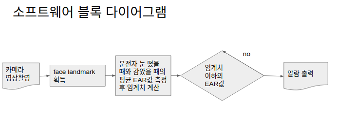
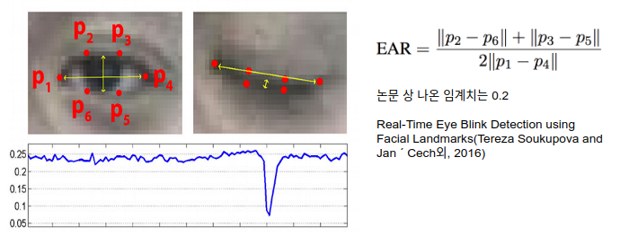

# Team Logo


## 팀소개 및 프로잭트 설명 동영상

졸음운전 여부를 판단하여 알림을 통해 사고를 예방하는 기기를 제작하는 팀입니다.

## 기능 설계




## 컴퓨터 구성 / 필수 조건 안내 (Prerequisites)
* Debian 계열 os
* openCV 4.X 버전
* (권장)라즈베리파이 3B+
* 피에조 부저 필요(GPIO 16번 연결)

## 기술 스택 (Technique Used)

### Drowsing detection

* Real-Time Eye Blink Detection using Facial Landmarks(Tereza Soukupova and Jan ´ Cech외, 2016)의 방법을 따름



### Raspberry GPIO control

사용자에게 가는 알림은 라즈베리파이 GPIO를 사용함.

## 설치 안내 (Installation Process)

dlib 라이브러리 필요:
``` shell
git clone https://github.com/davisking/dlib.git
cd dlib
git clone https://github.com/osamhack2020/IoT_drowsinessCare_GyeongHoKim.git .
```

## 프로젝트 사용법 (Getting Started)

cmake 빌드
``` shell
mkdir build&&cd build
cmake ..
cmake --build . --config Release
```

프로그램 실행
`./sleep_detection`

**라즈베리에서 실행할 경우**  
CMakeLists.txt 파일의 project name을 sleep_detectionForRaspberry로 고쳐야 함.
또, wiringPi 27번에 해당하는 GPIO 핀에 부저를 연결해야 함.  

``` shell
gpio readall //wiringPi 27번에 해당하는 BCM 넘버를 찾아야 함
```


## 팀 정보 (Team Information)
- 김경호 (rlarudgh2017@gmail.com), Github Id: GyeongHoKim

## 저작권 및 사용권 정보 (Copyleft / End User License)
 * [MIT](https://github.com/osam2020-WEB/Sample-ProjectName-TeamName/blob/master/license.md)
